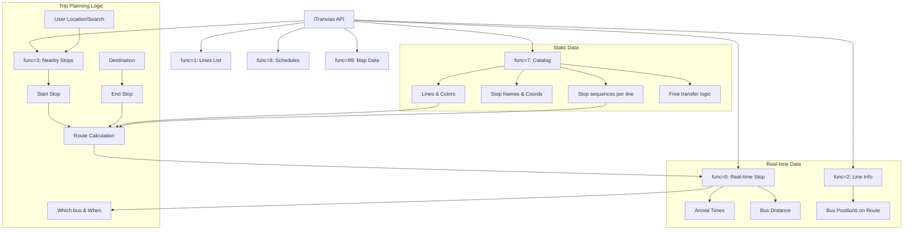

# iTranvías API Map & Trip Planning Strategy

## API Overview
**Base URL:** `https://itranvias.com/queryitr_v3.php`

The API uses two main parameters: `func` (Function Code) and `dato` (Data/Parameters).

### Endpoint Reference

| `func` | Name | `dato` Format | Description |
| :--- | :--- | :--- | :--- |
| **0** | **Stop Real-time Arrivals** | `{stop_id}` | Real-time arrival estimates for all lines at a specific stop. |
| **1** | **Lines List** | `1` | List of all available bus lines with IDs and names. |
| **2** | **Line Real-time Info** | `{line_id}` | List of stops and current bus positions for a specific line. |
| **3** | **Nearby Stops** | `{lat}_{lng}_{radius}_{max}` | Finds stops within a certain radius of coordinates. |
| **7** | **Full Catalog** | `{date}_{lang}_{msg}_{news}` | Returns all static data (lines, stops, routes, prices). |
| **8** | **Line Schedules** | `{line_id}&fecha={YYYYMMDD}` | Planned departure times for a line on a specific date. |
| **99** | **Map Visualization** | `{line_id}&mostrar={B\|PRB}` | Polyline data and bus positions for map rendering. |

---

## Conceptual Map (Mermaid)

---

## Strategy for the PWA

### 1. Data Management
- **Persistent Cache:** Store the catalog (`func=7`) in IndexedDB or LocalStorage. Only update it when the API indicates a new version (checking the `actualizacion` field).
- **Favorites:** Store stop IDs locally.

### 2. Trip Planning Algorithm (Client-Side)
Since the API doesn't have a direct "Route Planner" endpoint that returns bus options, we will:
1. **Stop Discovery:** Find stops near the origin and destination (from the cached Catalog).
2. **Direct Routes:** Filter lines that pass through both a stop near the origin and a stop near the destination (in the correct order).
3. **Transfer Routes:** Use the `enlaces` data from the catalog to find possible transfers if no direct route exists.
4. **Real-time Enrichment:** Once a route is selected, call `func=0` for the origin stop to show the actual arrival time.

### 3. Astro Implementation
- **SSR for initial load:** Fetch the line list or catalog on the server if possible for faster FCP.
- **Islands/Client-side JS:** Use React/Preact islands for the real-time updates and the trip planner logic.
- **PWA Features:** Manifest and Service Worker for offline access to the cached catalog and favorite stops.
